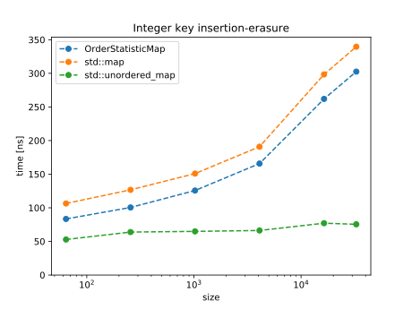
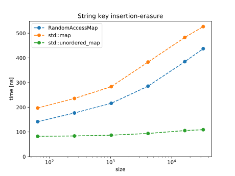
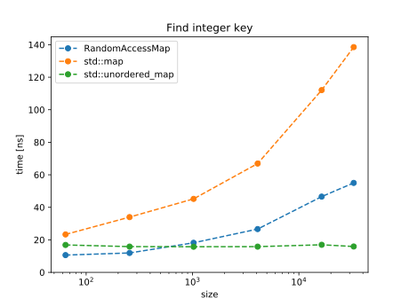
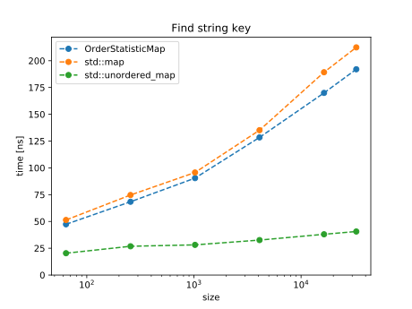
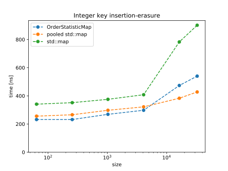
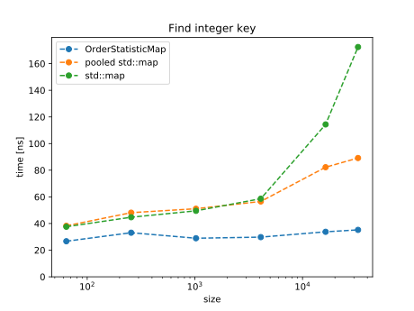
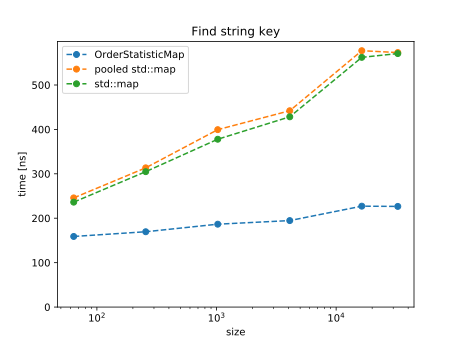

# Order Statistic Map Library
This header only library provides efficient implementations of an order statistic map or set data 
structure, designed for, but not limited to, Monte Carlo sampling. 

Insertion, removal, and access to the i-th ordered element are all O(log n) operations.

An additional container `SamplingMap` allows to sample with a random number generator in O(log n)
a value stored in the map, with a probability proportional to an user defined weight.  

# Installation
The library is headers only, just copy the content of the `include` folder somewhere in your include
search path.

## Documentation
Additional documentation of public methods, is provided in the source declaration. 

[maplib::OrderStatisticMap](documentation/order_statistics_map.md)

[maplib::OrderStatisticSet](documentation/order_statistics_set.md)

[maplib::SamplingMap](documentation/sampling_map.md)

[maplib::SamplingSet](documentation/sampling_map.md)

## Performance
The `OrderStatisticMap` container consistently outperforms the standard library `std::map` for 
different types and sizes of inputs, despite the need to perform a small number of extra operations 
to keep the indexing up to data. The difference is larger in a warm cache scenario, where a small
list of elements is frequently inserted, removed, or searched.

This was tested against the standard library using the default allocator 
(labelled `std::map` in the figures), and using the same pooled allocator as the OrderStatisticMap  
(labelled `pooled std::map` in the figures). 

When erasure is performed, pointers rather than values are moved around, keeping other iterators
valid. This also allows to efficiently insert and erase key-value pairs with a large stack size,
while paying a negligible price for pairs smaller than the pointers stored in a node.

`OrderStatisticMap::insert` (`OrderStatisticMap::erase`) is optimized for the case of an insertion of
a not yet present (already present) key.

The following benchmarks were run using the [Google benchmark](https://github.com/google/benchmark)
library on an Intel(R) Core(TM) i7-8700K CPU using GCC 9.3.0 with -O3 optimization.

### Cold cache 
The insertion-erasure test is performed by adding and removing different keys at each iteration, keeping
the container size constant during sampling.  

The find test is performed by searching different keys at each iteration. 

### Warm cache
The warm cache tests are performed by reusing recently used keys. This also removes most of the 
rebalancing cost from the measurement.

## Conclusion
On top of providing Monte Carlo specific features it is 
advantageous to use the provided `RandomAccesMap` over `std::map` for general applications, if 
the additional O(1) memory usage is not a concern, or the container allocation needs not be 
shrinked during its lifetime.
